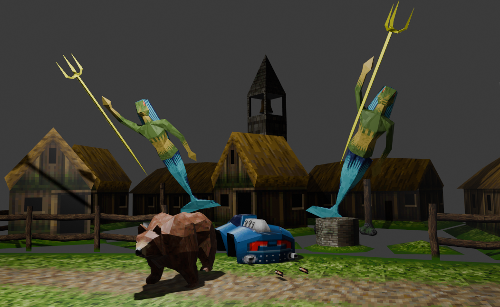

# MascotCapsule MBAC/MTRA -> Blender

A Blender 4.0 add-on that imports MascotCapsule Micro3D binary models
(`.mbac`) together with their binary animations (`.mtra`), rebuilding the
skinned mesh, the bone hierarchy, the materials/UVs and a normal Blender
action with keyframed pose bones.

## Install (Blender 4.0)

1. Download the latest .zip archive with addon from the Releases section
2. In Blender: **Edit > Preferences > Add-ons > Install...** and pick the zip.
3. Enable **MascotCapsule MBAC/MTRA Importer**.

## Usage

**File > Import > MascotCapsule (.mbac / .mtra)** and pick the `.mbac`
(the file browser also accepts `.mtra`). The add-on automatically looks for:

* the sibling animation: `same_name.mtra`
* the textures, next to the `.mbac`, named after the model or the
  `textureNN.bmp` convention:
  * one texture: `texture.bmp`, `texture01.bmp`, `<model>.bmp`, `fx.bmp`
  * several textures (partial texturing): `texture01.bmp`, `texture02.bmp`, ...

Missing images are not an error: the importer still creates a material with an
empty Image Texture node so the file can be attached later in the Shading
editor. **(or check the namings)**

Addon can be used for MBAC, MTRA conversion to .OBJ, .FBX etc, using the Blender tools.
Remember, that addon was tested only on few bunch of models. Rare models still can 
cause some random software crashes, errors, so fill free to open the issues and contribute.

## Special Thanks

This plugin incorporates code and algorithmic concepts from the following projects:
* [MascotCapsule — `mtratool.py`](https://github.com/j2me-preservation/MascotCapsule/blob/master/tools/mtratool.py)
* [MBAC-to-OBJ — `Program.cs`](https://github.com/Durik256/MBAC-to-OBJ/blob/master/Program.cs)
* [Noesis-Plugins — `fmt_mbac.py`](https://github.com/Durik256/Noesis-Plugins/blob/master/fmt_mbac.py)

The plugin also incorporates functionality based on the original **PVMicro toolkit**.
Some of this functionality was **recreated with the assistance of AI** rather 
than reverse-engineered.


## What it builds

* **Mesh** with per-corner UVs (MBAC stores UVs in texels; they are normalised
  against the *matching* texture size and V-flipped for Blender/BMP
  conventions).
* **Materials**: one per MBAC texture, each with an Image Texture node wired to
  the Principled BSDF.  The texture node uses **Closest** (nearest neighbour)
  interpolation for the authentic pixelated MascotCapsule look.
* **Multiple textures / UV maps**: when a model is partially textured (e.g.
  `testmodel-4-forest`, whose leaves use `texture02`), each texture gets its own
  UV map (`UVMap`, `UVMap_texture02`, ...) and its own material, and the faces
  are assigned to the right material slot.
* **Armature** reconstructed from the MBAC bone hierarchy.  A bone's rest
  orientation is taken from its 3x4 matrix (Y = bone direction, Z = rotate
  axis), so the imported rest pose matches the model.
* **Skin weights**: MBAC binds vertices rigidly and sequentially to bones
  (one bone per vertex, weight 1.0), exposed as vertex groups.
* **Action**: MTRA is sampled and written into the standard pose-bone
  `location` / `rotation_quaternion` / `scale` F-curves, with LINEAR
  interpolation (TRA4 uses linear interpolation).  By default every frame is
  baked so the result is exact; disable *Bake every frame* to key only at the
  authored keyframes.

## Units and animation semantics

The TRA4 binding was verified against the MascotCapsule V3 reference runtime
(`ActionTable.rotate`/`roll`, `AffineTrans`, `Util3D.sin/cos`):

* `translate` is in raw integer model units,
* `scale` is 4.12 fixed point (4096 == 100%),
* `rotate` is a 4.12 fixed point **unit direction vector** for the bone +Z axis,
* `roll` is 4.12 fixed point **turns** (4096 == 360 deg, 1024 == 90 deg) —
  treating it as degrees was the cause of the exaggerated rotations,
* the delta is `Translate . Rotate . Roll . Scale` applied as
  `L_bone(t) = L_bone_rest . Delta(t)`, `W_bone(t) = W_parent(t) . L_bone(t)`.

The importer applies a uniform **scale** (default `0.01`) to the mesh, the
armature and the animation, because the original converter emits values ~100x
too large for Blender units.

## Architecture notes

* `core/` never imports `bpy`, so the parsing/math can be changed or tested
  without Blender.
* `importer.py` is the only place that builds Blender data.
* `ui.py` is the only place that touches Blender UI/operators.

## Testing

```sh
python -m unittest discover -s tests -v
```

The tests parse the sample corpus (`testmodel-1-aquar/`, `testmodel-4-forest/`,
`samples_mtra/`) and check subtype decoding, the texture/pattern table, the
trailer decoding and the animation math.  They skip any file that is absent.

## Known limitations

* **MTRA version 4** (e.g. `samples_mtra/model0.mtra`) uses a different, older
  body encoding that is not decoded yet; importing it raises a clear error.
  See `../MTRA_SUBTYPE_NOTES.txt`.
* MTRA v5 segment type 3 is now decoded (`translate(const) + rotate +
  roll(const)`) from the reference runtime; no sample exercises it yet.
* MBAC models with more than one *pattern* (dynamic polygons) only import the
  default pattern (pattern 0).
* Colored (untextured) polygons get a plain material; the vertex-colour palette
  is parsed but not yet applied to the mesh.

## Changelog

* **0.2.0**
  * Auto-scale import (`Scale`, default `0.01`).
  * Auto texture discovery and material creation, including a stub material
    with an empty Image Texture node when the image is missing.
  * Two-texture (partial texturing) support: per-texture UV maps, materials and
    face material assignment.
  * Image textures use `Closest` interpolation.
  * Fixed MTRA `roll` units (4.12 fixed-point turns); rotations now match the
    reference runtime.
  * Decoded MTRA v5 segment type 3.
* **0.1.0** — initial MBAC/MTRA importer.
